# Knowra

**Ask. Explore. Understand.**

Knowra is a place to keep documents and ask questions about them. Answers come from the files in the workspace you are in, not from the open web.

You can use Knowra on your own, or inside an organization with other people. The same account can belong to several organizations and switch between them.

This guide walks through every page. It is the same in the Knowra app and the Knowra API repository.

## Pages

| Page | Who can open it | What it is for |
| --- | --- | --- |
| Sign in | Everyone signed out | Email code, and for a new account, Personal or Organization |
| Join | Anyone with an invite link | Join an organization as a member |
| Workspace | Signed in | Chat, switch workspaces, open chats |
| Files | Personal, and organization admins | Upload, folders, preview, rename, move, delete |
| Profile | Signed in | Photo, name, storage, and AI usage |
| Settings | Signed in | Preferences, organization, AI, data, and account |

The account menu at the bottom of the sidebar opens **Profile**, **Settings**, and **Log out**.

## Sign in

Open Knowra and enter your email. A one-time code arrives by email. Enter it to continue. You can resend the code after a short wait. There is no password.

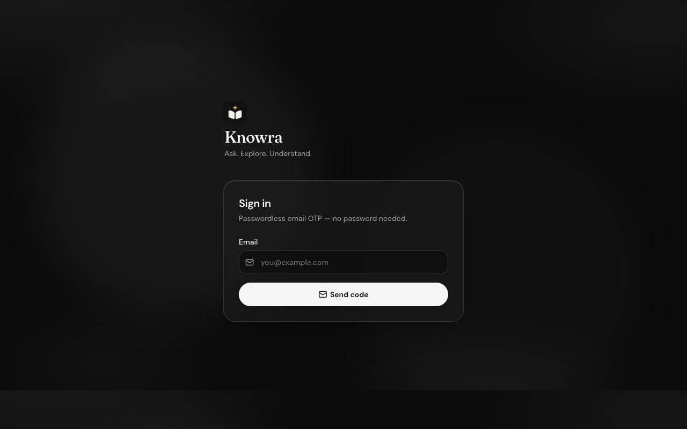

The code screen shows the address it was sent to, a countdown until it expires, **Verify & continue**, **Resend code**, and **Use a different email**.

What happens next depends on whether the account already exists.

- **You have used Knowra before.** You go straight into the app. You are not asked to choose again.
- **This is a new account.** After the code, Knowra asks how you will use it. This step does not appear on later sign-ins.

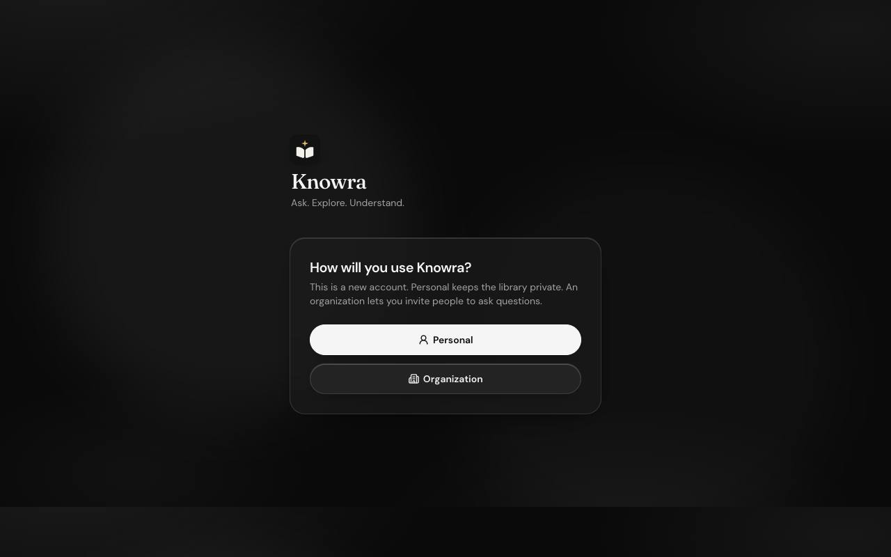

**Personal** opens your own library. Files and AI keys stay yours.

**Organization** asks for a name. The name must be unique across Knowra, from 2 to 80 characters. You become the admin, and the account is created inside that organization.

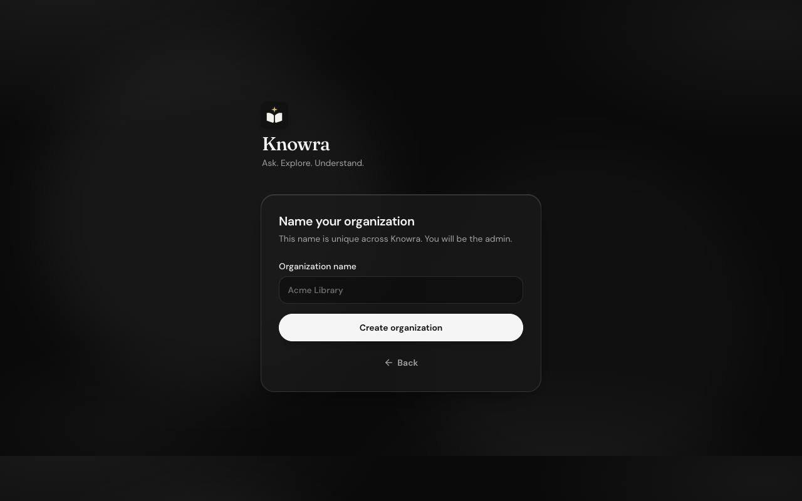

**Create organization** checks the name and, if it is free, creates it. **Back** returns to the Personal or Organization choice. If the name is already taken, Knowra says so and does not create a second one.

An organization can only be created in that new-account step. It cannot be created later from Settings.

## Join an organization

An admin copies an invite link from **Settings → Organization**. The link looks like `/join/` followed by the organization name.

- **You are signed out.** The page asks for your email and a code. After the code, you join as a member.
- **You are already signed in.** The page shows a **Join organization** button.
- **Joining is blocked.** The page says the organization is not accepting new members. Existing members are unchanged.
- **You were blocked.** The link will not let you back in until an admin unblocks you.

New members can ask questions. They do not get the file library, model choice, or AI keys.

## Workspace

The sidebar is home base.

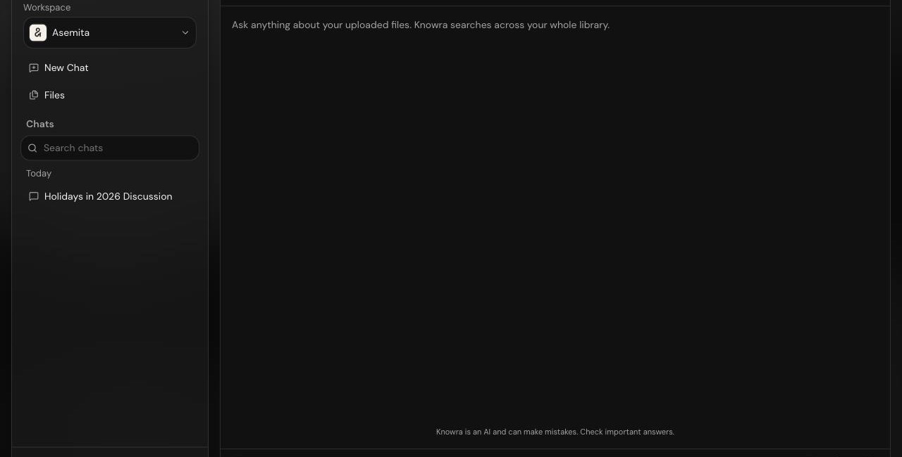

**Workspace switcher.** Opens a list of **Personal** and every organization you belong to. Personal uses your profile photo. An organization uses its logo, or a two-letter mark from its name. The current one is checked. Choosing another reloads that workspace: its files, its chats, and its AI keys.

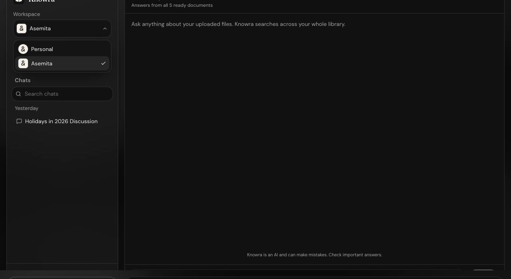

**New Chat.** Starts a fresh conversation in the current workspace.

**Files.** Opens the library. Hidden for organization members.

**Chats.** Lists your conversations in this workspace, grouped by day. Search filters them. Each person has their own chats, even inside an organization. Older chats load as you scroll.

**Ask.** The box at the bottom sends a question. **Ask** stays off until there is text, a ready file, and AI is set up. While an answer is on the way, the box locks.

Knowra then shows a live status instead of a blank wait. The label moves through **Searching your files**, **Reading the passages**, **Connecting the details**, and **Drafting an answer**. When the reply arrives, it types in under the Knowra mark and the time.

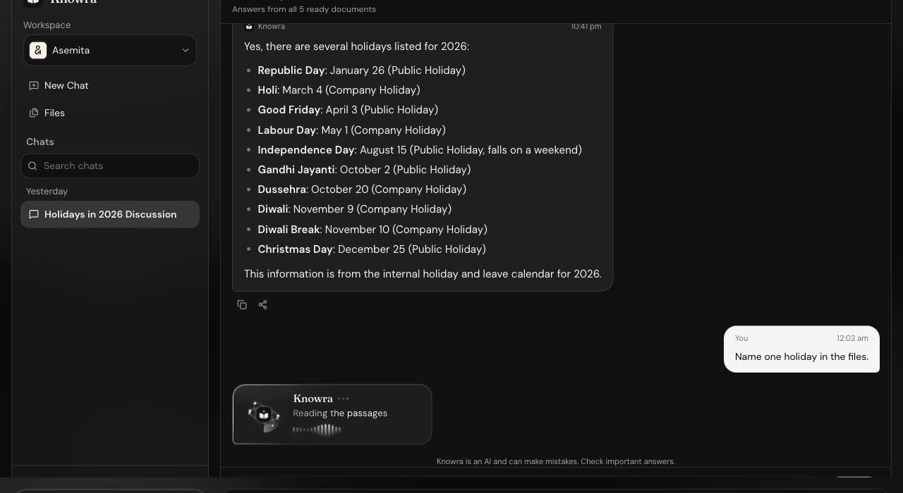

The finished reply has **Copy** and **Share**. Copy puts the text on the clipboard. Share opens the device share sheet, or copies the text if the browser cannot share.

Answers come from the ready files in the current workspace. Knowra also knows today’s date, so “next month” uses the real calendar rather than a month mentioned inside a document. Your question and the reply are saved in that chat, so a follow-up stays in the same thread.

The header says how many files are ready. If none are ready, or AI is not set up, chat stays closed and tells you what is missing. Members are told to ask an admin. In Personal, or as an admin, you are sent to **Settings → AI** or to upload a file.

A short note under the transcript says Knowra is an AI and can make mistakes.

On a narrow screen the sidebar opens as a drawer, and you can move between the chat and an open document.

## Files

Admins, and anyone in Personal, manage files here. Organization members are sent back to the workspace.

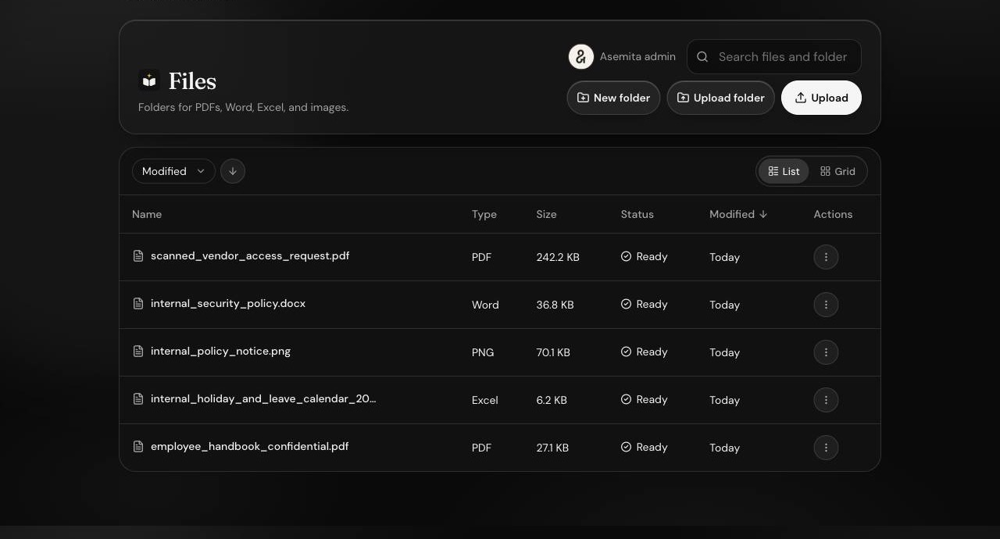

**Upload.** Adds PDFs, Word files, Excel files, and images. An OpenAI key must already be saved, because that key is what reads and indexes the file.

**Upload folder.** Uploads a folder and keeps its structure.

**New folder.** Creates a folder in the current location.

**Search.** Filters files and folders by name.

**Sort.** By name, type, size, status, or date modified, ascending or descending.

**List and grid.** Two ways to look at the same library.

**Open a folder.** Breadcrumbs and back take you through the tree.

**Click a file.** Opens a preview.

**Row menu.**

- **Open** the file.
- **Rename** the file or folder.
- **Move** it to another folder.
- **Delete** it. Deleting a folder removes what is inside it. Deleting a file also removes its search data.

A file moves through uploading and processing until its status is **Ready**. Chat only uses ready files. A failed file stays in the list with an error so you can see what went wrong.

In Personal, files belong to you. In an organization, files belong to the organization. Deleting your account does not delete organization files.

## Profile

Open **Profile** from the account menu, or **Edit profile** in Settings.

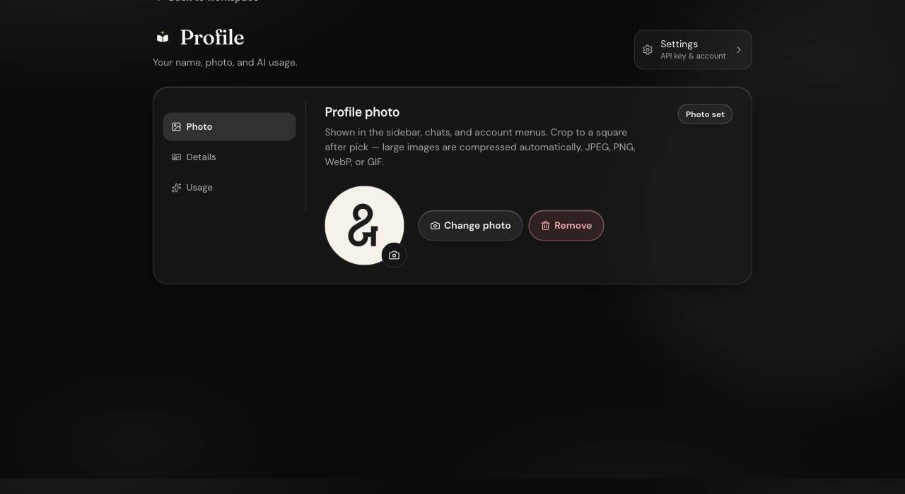

**Photo.** Shown in the sidebar, chats, and menus. You crop it to a square. JPEG, PNG, WebP, and GIF are accepted, and large images are compressed. **Change photo** replaces it. **Remove** clears it.

**Details.** Display name, up to 80 characters. Leave it blank to use the start of your email. The email itself is your sign-in address and cannot be changed here.

**Usage.** How much space this account is using, split into uploaded files, the search records made from those files, and the total. AI usage shows how your keys were used — uploads, reading scanned pages, embeddings, and chat — for today, this week, or this month. These numbers are for estimating cost. Knowra does not bill you.

## Settings

Settings has five sections. **AI** is hidden while you are only a member of an organization. The other sections stay.

### Preferences

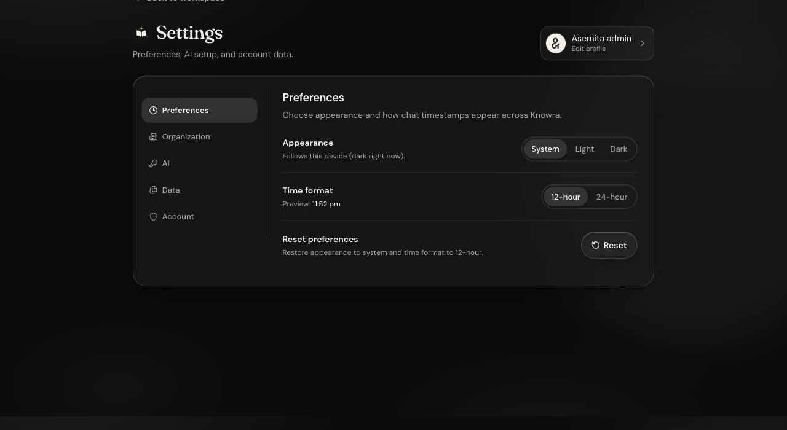

**Appearance.** System, Light, or Dark. System follows the device.

**Time format.** 12-hour or 24-hour. A preview shows the current time. Chat timestamps use this.

**Reset.** Restores System appearance and 12-hour time.

These choices stay on this browser.

### Organization

Switch into an organization first if you want to manage it. The logo, invite link, joining control, and people list are only for the organization that is currently open, and only if you are an admin there.

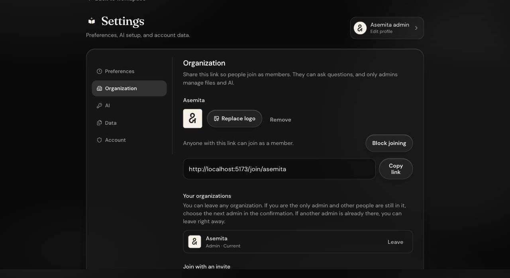

**Logo.** Upload, replace, or remove. It appears in the workspace switcher.

**Invite link.** Copy it and share it. Anyone who uses it joins as a member.

**Block joining / Allow joining.** Blocking stops the link from adding anyone new. People who are already members stay. Allowing turns the link back on.

**Your organizations.** Every organization you belong to, with your role. **Leave** is on each row.

- If another admin is already there, you can leave immediately.
- If you are the only admin and other people are still in it, the confirmation asks you to choose the next admin. Search that list by name or email. Their photo is shown. They get an email, and then you leave.
- If you are the only person in it, you can leave without choosing anyone.

Leaving removes your access to that organization’s files and chats. The organization’s files stay.

**Join with an invite.** Paste a link to join another organization without leaving the ones you are already in.

**People.** Admins only, at the bottom of this page. Everyone in the open organization is listed with their photo, name, and email. You are marked **You**. Search filters by name or email. Ten people show at a time, with **Previous** and **Next** when there are more.

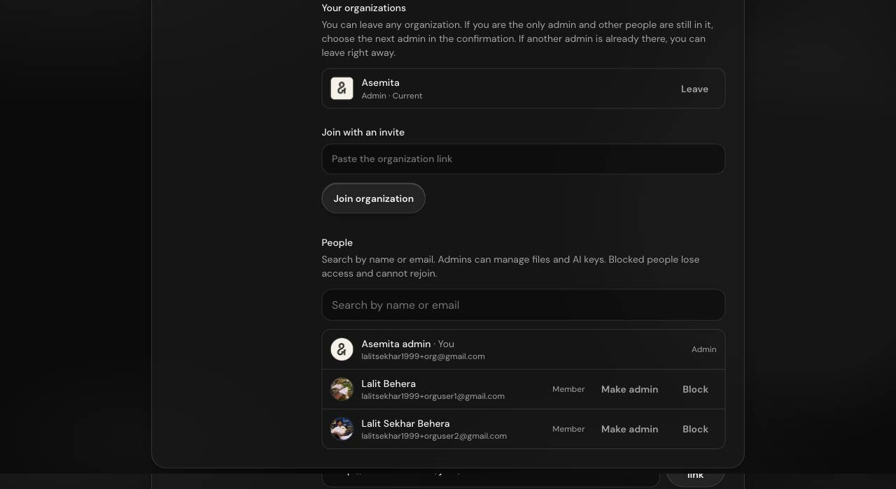

- **Make admin** is on members. It gives that person file, AI, and people access, and emails them that they were made an admin, including who did it.
- **Remove admin** is on other admins. It turns them back into a member. You cannot remove your own admin access. The organization always keeps at least one admin.
- **Block** removes their access. They disappear from the workspace switcher and cannot rejoin until you **Unblock** them. A blocked person stays in this list so you can restore them.
- You cannot block yourself.

Making someone an admin here is the same choice the leave and delete-account flows ask for when you are the only admin.

If you admin several organizations, switch to the one you want to manage. The others stay in **Your organizations** until you do.

Members still see **Your organizations**, **Leave**, and **Join with an invite**. They do not see the logo, invite link, joining control, or people list.

### AI

Shown in Personal, and when you are an admin of the open organization. Hidden for members. Organization keys are stored on the organization, not on your personal account.

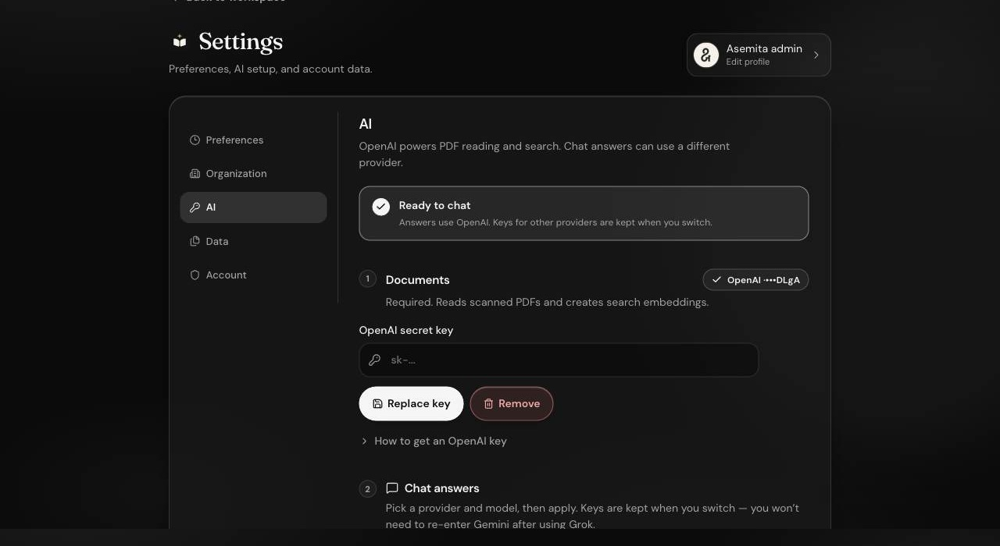

A status line says whether chat is ready.

**1. Documents.** An OpenAI key. Required. It reads scanned pages and builds search. Save it, replace it, or remove it. Only the last four characters are shown after it is saved.

**2. Chat answers.** Pick a provider and a model, then apply.

- **OpenAI** uses the same key as documents.
- **Claude, Gemini, and Grok** each need their own key.
- **Custom** is any OpenAI-compatible endpoint. You set the base URL and model. The key can be left blank for a local server.

Keys stay saved when you switch providers. You do not re-enter a Gemini key after using Grok. OpenAI is still required for reading and search even when chat uses another provider.

### Data

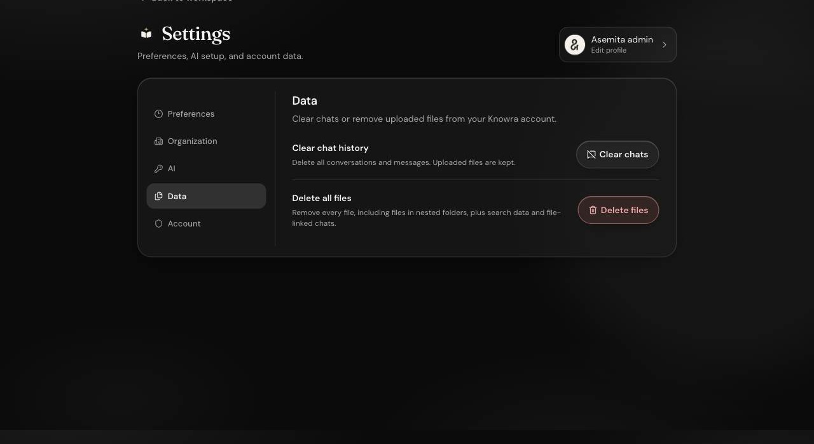

**Clear chats.** Deletes every conversation in the current workspace. Files stay. In an organization this clears your chats there, not anyone else’s, and not your personal chats.

**Delete files.** Admins only. Asks for an email code, then removes every file in the current workspace, including nested folders, plus the search data and chats tied to those files. Personal delete does not remove organization files, and organization delete does not remove personal files.

Members see **Clear chats** only.

### Account

**Edit profile.** Opens Profile.

**Sign out.** Ends the session on this browser. You can sign in again with a new code.

**Delete account.** Asks for an email code, then waits 7 days. Sign in again during that window to cancel.

If you are the only admin of an organization that still has other people, you must make someone else an admin before the account can be deleted. If another admin already exists, or you are the only person in the organization, you can delete without that step.

Deleting your account removes your personal files and chats. Organization files, keys, logo, and members stay.

## Who can do what

| | Personal | Organization admin | Organization member |
| --- | --- | --- | --- |
| Chat on ready files | Yes | Yes | Yes, with the organization’s keys |
| See and edit files | Yes | Yes | No |
| AI keys and model | Your own | The organization’s | No |
| Invite, logo, people | — | Yes, for the open organization | No |
| Join or leave organizations | Yes | Yes | Yes |
| Clear your chats | Yes | Yes | Yes |
| Delete all files | Yes, personal files | Yes, that organization’s files | No |
| Delete your account | Yes | Yes, after another admin exists if you are the only one | Yes |

## A short path through the product

1. Sign in with the code from your email.
2. On a new account, choose Personal or create an organization.
3. In Personal, or as an organization admin, open **Settings → AI** and save an OpenAI key. Choose a chat provider if you want one.
4. Upload files and wait until they are **Ready**.
5. Ask a question in the workspace.
6. Share the organization invite if other people should be able to ask questions too.

## Run it locally

Knowra is two projects that run together.

| Project | What it is | Usual address |
| --- | --- | --- |
| Knowra | The web app | http://localhost:5173 |
| Knowra-api | The API | http://localhost:4000 |

From each project:

```bash
pnpm install
cp .env.example .env
pnpm dev
```

The app expects the API at `http://localhost:4000/api`. Put your own keys, database, mail, and file storage in the API environment file. Do not commit `.env`.
